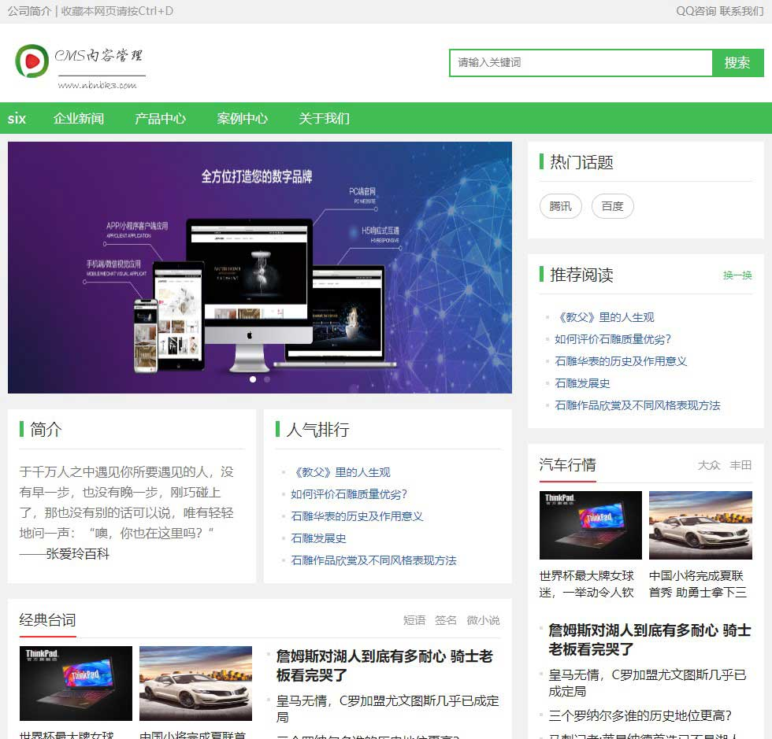
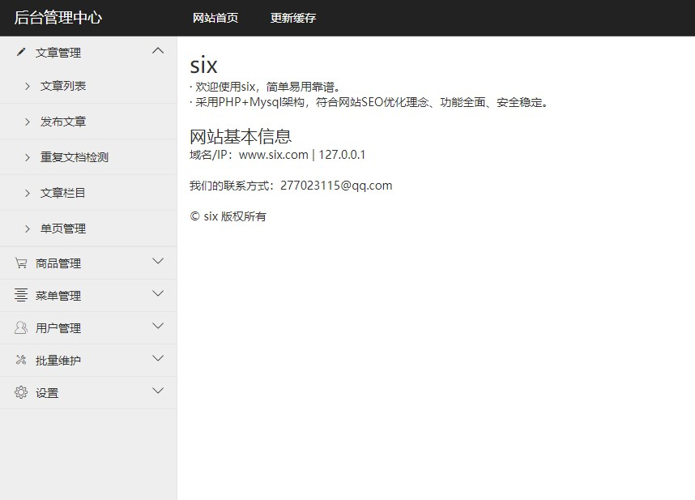

# Lyend
基于laravel6的cms

## 效果截图

PC端

后台管理

## 说明

1、基于Laravel6

2、PHP+Mysql

3、后台登录：http://www.lyend.com/fladmin/login，账号：admin888，密码：123456

4、适合博客、中小企业建站二次开发。

5、http://www.lyend.com只是示例域名，需换成自己绑定的域名

<strong>PC入口</strong>：http(s)://+PC域名+/

7、后台功能
1) 文章管理：增删改查，栏目管理
2) 单页管理
3) RBAC权限管理，管理员/角色管理，权限授权
4) 商品管理：商品品牌，商品分类
5) 订单管理：订单列表，订单详情，订单导出EXCEL
6) 会员管理：会员等级，余额记录，提现，充值
7) 轮播图
8) 友情链接
9) 系统参数配置

8、前台功能
1) 公司介绍
2) 产品中心
3) 新闻动态
4) 联系我们
5) 友情链接

## 安装

跟laravel6安装一样，只是多了一步数据库导入

1、 导入数据库

1) 打开根目录下的lyend.sql文件，替换文件里面的 http://www.lyend.com 为自己的站点根网址，格式：http(s)://+域名

2) 导入数据库，导入完成之后，因为数据表有索引，需要修复表不然很容易报错

2、 修改数据库连接参数

打开env文件,修改相关配置

3、 根目录执行 Composer install 或 Composer update 示例：php composer.phar install 或 php composer.phar update

4、 登录后台->系统设置->系统配置参数，更新配置：http://www.lyend.com/fladmin/index/upcache

Linux系统文件/目录权限

 + storage目录设置成可读写777
 + public/uploads目录设置成可读写777
 + public/index.php文件设置成只读444

## 注意

站点只能放在根目录

public目录做为网站根目录，入口文件在 public/index.php

## 环境要求

* php7.2.0+
* mysql5.6+
* PDO PHP Extension
* MBstring PHP Extension
* CURL PHP Extension
* 打开rewrite

> Laravel6的运行环境要求PHP7.2.0以上。

## 使用许可

lyend是基于Laravel6的开源系统，它完全免费，可以自由的进行二次开发。

## Bug及建议

如有Bug欢迎开Issues或者邮箱 277023115@qq.com 留言，如有好的建议以及意见也欢迎交流。

